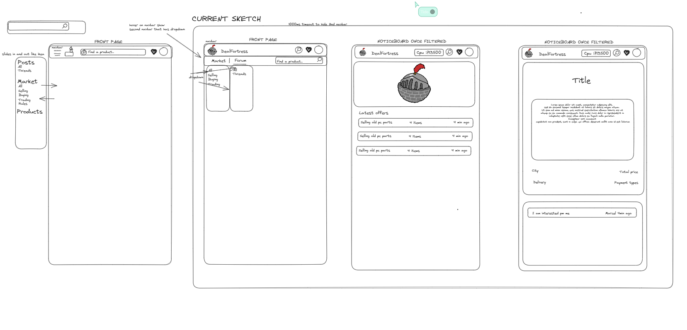
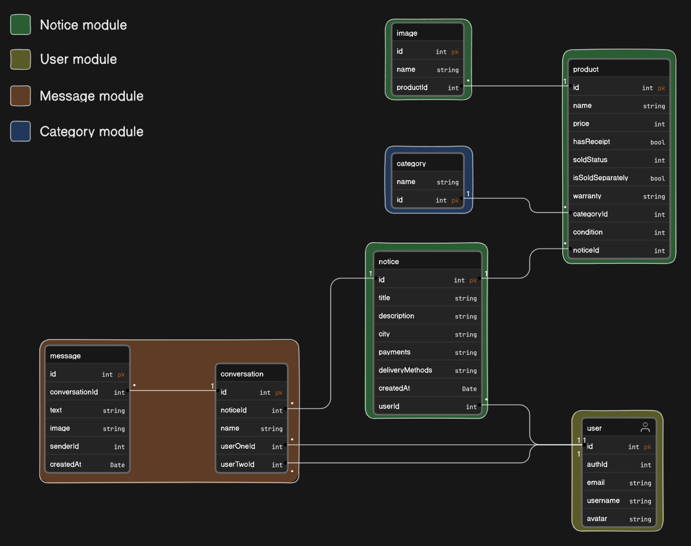

# DealFortress 
Deal Fortress is a full-stack web application 
full pair programmed (until january 2024) by [Luc Siat](https://github.com/Luc-Siat) and [Atte Pitkänen](https://github.com/attepitkaenen) 

<strong> 
  Checkout the app [here](https://green-sand-04a2d9f03.3.azurestaticapps.net/) (Please note that there is a cold start on the DB, give it 20 seconds on the first launch) 
</strong>

### Pitch

DealFortress aims to bridge the gap between the UI of first hand and the concept of second hand. 
  - We do not want people to spend hours reading ad description hoping to find what they want. Here they will be able to utilize the filters and the DB separation of the ad and the different products. This means they can filter to get this product at this price.
  - We want to leverage the community to flag scams and rate sellers. Here they will have a dedicated website with a reputation system, this solves the scam issue that bigger platforms like Tradera or Facebook Market might be facing. And who knows maybe one day we will have BankID?

## Project

<strong>Github project board for DealFortress can be found <strong>[here](https://github.com/orgs/DealFortress/projects/2/views/1)  
See more about the project in our [pitch deck](https://docs.google.com/presentation/d/1hlW0DBOonpe2wFysVZdgJIRN3Cm0_9keEeikIJLs-qU/edit?usp=sharing)

#### Features that have been developed without pair programming:

Luc:
  - Conversation system with notifications
  - Pagination

## Videos
[2 minute video on the pitch deck](https://youtu.be/FD3JxMlWXQQ) 

[Deal Fortress overview by Luc Siat - Sep. 2023](https://studio.youtube.com/video/abTcDyegfxM/edit) 

[Demoing DealFortress features - Nov. 2023](https://studio.youtube.com/video/abTcDyegfxM/edit) 

<!-- [30 minute pair programmed coding session](https://youtu.be/bgvt1kpQ9RY) -->

## Tech stack

### Backend

  - .NET/C# REST API using a modular monolith architecture

  - SignalR Library

  - Entity Framework Library

  - Azure Sql DB & Azure web app services 

### Frontend
  
  - Angular 17
    
  - NGRX Store
    
  - SignalR

  - Azure static webpages
    
  - TailwindCSS, DaisyUI & FontAwesome

### Tools

  - Github Actions & Project
    
  - Auth0

  <!-- - Design sketch: [Figma prototype and components](https://www.figma.com/file/6pMA53jsPBJ6p0kguOzKba/Deal-Fortress-prototype?type=design&node-id=0-1&t=9esxib8YXRiofpYN-0) -->
  
  - Wireframe: [Excalidraw](https://excalidraw.com/#room=2ab6f5d1e7b980f0d720,gnL2G7lG_2TnaVrYLOBTKg)
  
  - UML and Data sketches: [Eraser](https://app.eraser.io/workspace/fNTcdg5ZpTmM6w0OyhfA)

<!--  -->

## Screenshots

### Wireframe sketch

### UML sketch

## License
This project is licensed under the MIT License. See the LICENSE file for more information.
