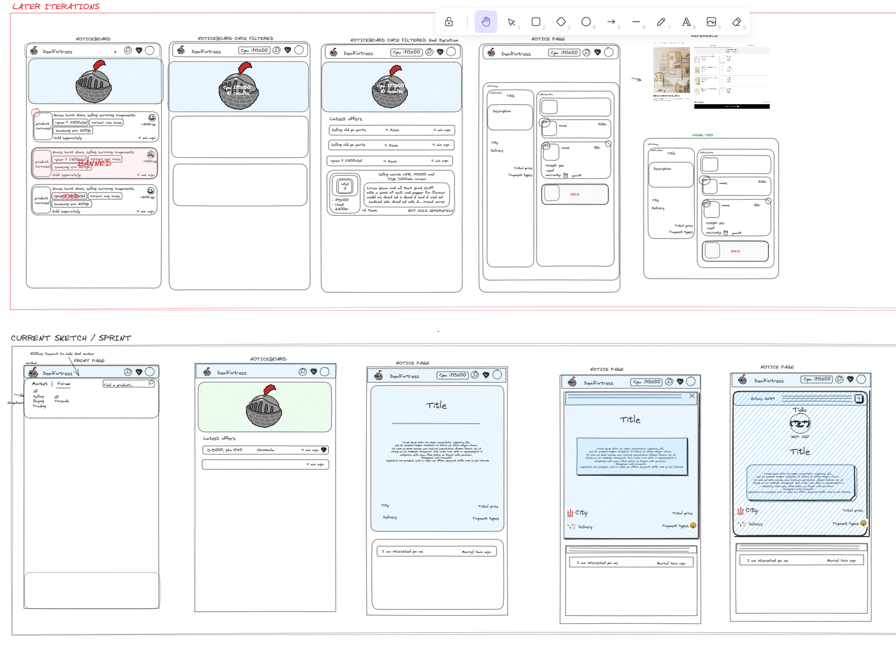

# DealFortress 
Deal Fortress is a full-stack web application 
made in pair programming by [Luc Siat](https://github.com/Luc-Siat) and [Atte Pitkänen](https://github.com/attepitkaenen) 

<strong>See more about the project in our [pitch deck](https://docs.google.com/presentation/d/1hlW0DBOonpe2wFysVZdgJIRN3Cm0_9keEeikIJLs-qU/edit?usp=sharing)  
or checkout our 2 minutes video on the pitch deck [pitch deck video](https://streamable.com/geq9mt)</strong>

## Context

Sweden is missing a modern marketplace for used computer parts which DealFortress looks to fix

## Tech stack

  - .NET with C#

  - Entity Framework

  - React with Vite & Typescript

  - Github Actions & Project

  - Azure Sql DB, Azure web app services & Azure static webpages

## Sprint videos:

First week sprint:[here!](https://streamable.com/3ym4bb)

Second week sprint: [here!](https://streamable.com/v45qbl)

## Tools & Libraries:

  <!-- - Auth0
  - Formik -->
  - Design sketch: [Figma prototype and components](https://www.figma.com/file/6pMA53jsPBJ6p0kguOzKba/Deal-Fortress-prototype?type=design&node-id=0-1&t=9esxib8YXRiofpYN-0)
  
  - Wireframe: [Excalidraw](https://excalidraw.com/#room=2ab6f5d1e7b980f0d720,gnL2G7lG_2TnaVrYLOBTKg)
  
  - UML and Data sketches: [Eraser](https://app.eraser.io/workspace/ODF2nY7EUHBNB5rJDnyo?origin=share)
  
  - Tailwind

<!--  -->

## Screenshots

Wireframe sketch

UML sketch

## Retro template:

[Our retros](https://excalidraw.com/#room=508eb9dcd37a4f56d616,BPYWqjGnqLennZR7ifKXyA)

## License
This project is licensed under the MIT License. See the LICENSE file for more information.
